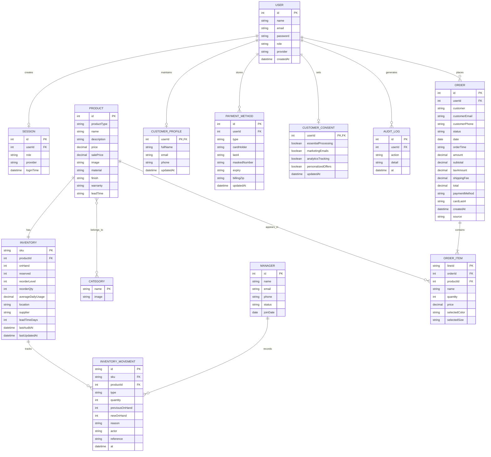

# Application Entity Diagram

This application is a client-side React retail app. Its main business data is stored in React context and `localStorage`.

## Mermaid ER Diagram



## Plain Text Version

```text
USER
- id (PK)
- name
- email
- password
- role [admin, manager, customer]
- provider [password, google]
- createdAt

SESSION
- id (PK)
- userId (FK -> USER.id)
- role
- provider
- loginTime

MANAGER
- id (PK)
- name
- email
- phone
- status
- joinDate

CATEGORY
- name (PK)
- image

PRODUCT
- id (PK)
- productType
- name
- description
- price
- salePrice
- image
- categories [many]
- industries [many]
- colors [many]
- sizes [many]
- material
- finish
- warranty
- leadTime
- specs

INVENTORY
- sku (PK)
- productId (FK -> PRODUCT.id)
- onHand
- reserved
- reorderLevel
- reorderQty
- averageDailyUsage
- location
- supplier
- leadTimeDays
- lastAuditAt
- lastUpdatedAt

INVENTORY_MOVEMENT
- id (PK)
- sku (FK -> INVENTORY.sku)
- productId (FK -> PRODUCT.id)
- type [INIT, IN, OUT]
- quantity
- previousOnHand
- newOnHand
- reason
- actor
- reference
- at

ORDER
- id (PK)
- userId (FK -> USER.id, logical link)
- customer
- customerEmail
- customerPhone
- shippingAddress
- status
- date
- orderTime
- amount
- pricing { subtotal, taxRate, taxAmount, shippingFee, total }
- payment { method, cardLast4, expiryDate }
- createdAt
- source

ORDER_ITEM
- lineId (PK)
- orderId (FK -> ORDER.id)
- productId (FK -> PRODUCT.id)
- name
- quantity
- price
- selectedColor
- selectedSize

CUSTOMER_PROFILE
- userId (PK/FK -> USER.id)
- fullName
- email
- phone
- updatedAt

PAYMENT_METHOD
- id (PK)
- userId (FK -> USER.id)
- type
- cardHolder
- last4
- maskedNumber
- expiry
- billingZip
- updatedAt

CUSTOMER_CONSENT
- userId (PK/FK -> USER.id)
- essentialProcessing
- marketingEmails
- analyticsTracking
- personalizedOffers
- updatedAt

AUDIT_LOG
- id (PK)
- userId (FK -> USER.id)
- action
- detail
- at

RELATIONSHIPS
- USER places ORDER
- ORDER contains ORDER_ITEM
- PRODUCT appears in ORDER_ITEM
- PRODUCT belongs to CATEGORY
- PRODUCT has one INVENTORY record
- INVENTORY has many INVENTORY_MOVEMENT records
- MANAGER records INVENTORY_MOVEMENT
- USER maintains CUSTOMER_PROFILE
- USER stores PAYMENT_METHOD
- USER sets CUSTOMER_CONSENT
- USER generates AUDIT_LOG
```

## Source References

- Product model: `src/data/products.js`
- Product inventory and categories: `src/context/ProductContext.js`
- Orders and order items: `src/context/OrderContext.js`
- Staff, customer users, and sessions: `src/context/AuthContext.js`
- Customer profile, payment methods, consent, and audit log: `src/pages/CustomerPortal.js`
- Checkout payload that connects cart to orders: `src/pages/Checkout.js`
